---
## Front matter
lang: ru-RU
title: Отчет по лабораторной работе №1
subtitle: Установка операционной системы Linux, дистрибутив Fedora Sway на виртуальную машину
author:
  - Спелов А. Н.
institute:
  - Российский университет дружбы народов, Москва, Россия
date: 23 февраля 2024

## i18n babel
babel-lang: russian
babel-otherlangs: english

## Formatting pdf
toc: false
toc-title: Содержание
slide_level: 2
aspectratio: 169
section-titles: true
theme: metropolis
header-includes:
 - \metroset{progressbar=frametitle,sectionpage=progressbar,numbering=fraction}
 - '\makeatletter'
 - '\beamer@ignorenonframefalse'
 - '\makeatother'

## Fonts
mainfont: PT Serif
romanfont: PT Serif
sansfont: PT Sans
monofont: PT Mono
mainfontoptions: Ligatures=TeX
romanfontoptions: Ligatures=TeX
sansfontoptions: Ligatures=TeX,Scale=MatchLowercase
monofontoptions: Scale=MatchLowercase,Scale=0.9
---

# Информация

## Докладчик

:::::::::::::: {.columns align=center}
::: {.column width="70%"}

  * Спелов Андрей Николаевич
  * НПИбд-02-23 Студ. билет:
  * Российский университет дружбы народов
  * [1132231839@pfur.ru](mailto:1132231839@pfur.ru)

:::
::: {.column width="30%"}
:::
::::::::::::::

# Вводная часть

## Цели и задачи

- Приобрести практические навыки установки операционной системы на виртуальную машину, настройки минимально необходимых для дальнейшей работы сервисов.

# Выполнение лабораторной работы

## Начало установки виртуальной машины

- На заранее установленный Virtual Box начинаем процесс установки виртуальной машины(называем машину, ставим тип системы)

:::
::: {.column width="30%"}

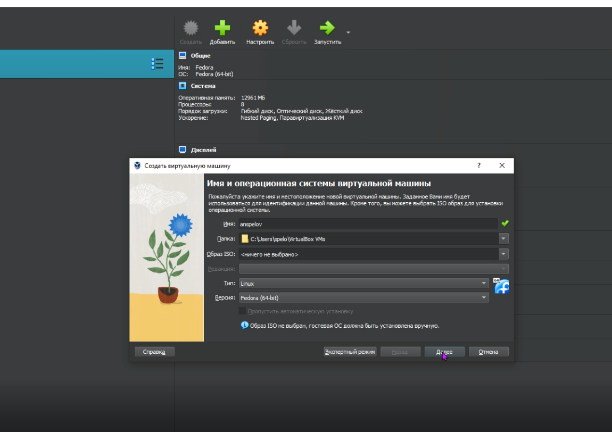

:::
::::::::::::::

## Установка виртуальной машины

- Ставим необходимое для работы количество памяти и ядер процессора
:::
::: {.column width="30%"}

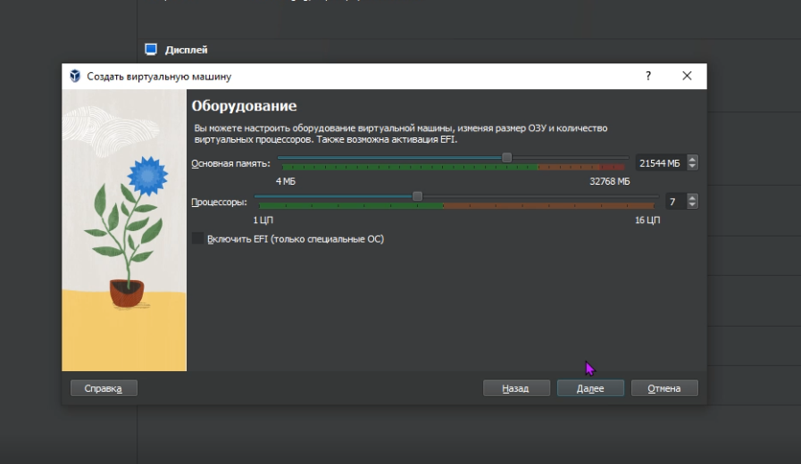

:::
::::::::::::::

## Установка виртуальной машины

- Ставим необходимое количество памяти жесткого диска на виртуальную машину(80+ Гб)

:::
::: {.column width="30%"}

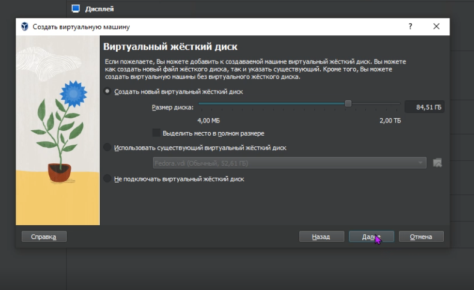

:::
::::::::::::::

## Установка виртуальной машины

- Закончив настройку виртуальной машины в меню Virtual Box выбираем заранее установленную систему Fedora Sway

:::
::: {.column width="30%"}

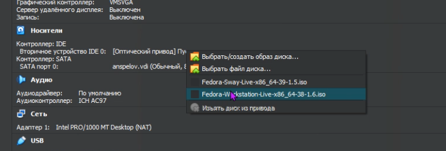

:::
::::::::::::::

## Заходим в систему

- Заходим на виртуальную машину

:::
::: {.column width="30%"}

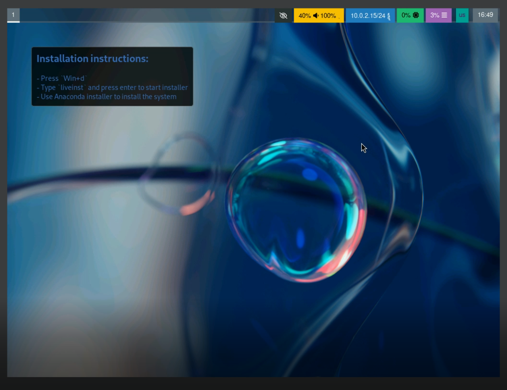

:::
::::::::::::::

## Начало установки системы

- Заходим в меню установки системы

:::
::: {.column width="30%"}

:::
::::::::::::::

## Установка системы

- Выбираем все необходимые параметры(раскладку клавиатуры, супер пользователя root) и начинаем установку

:::
::: {.column width="30%"}

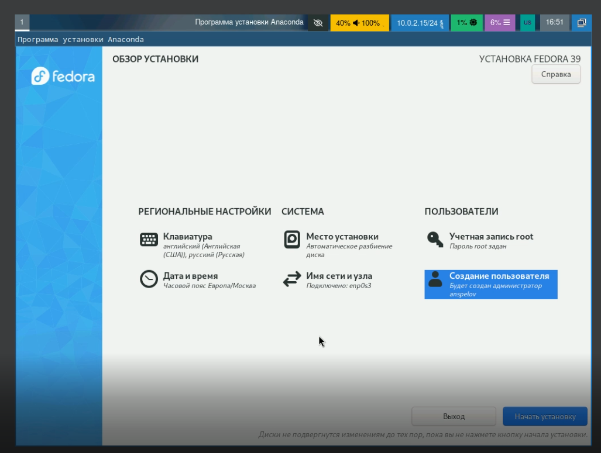

:::
::::::::::::::

## Конец установки системы

- После установки системы закрываем машину и убираем загрузочный диск

:::
::: {.column width="30%"}

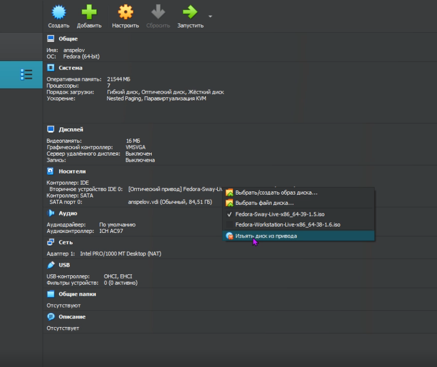

:::
::::::::::::::

## Запуск системы

- Запускаем виртуальную машину

:::
::: {.column width="30%"}

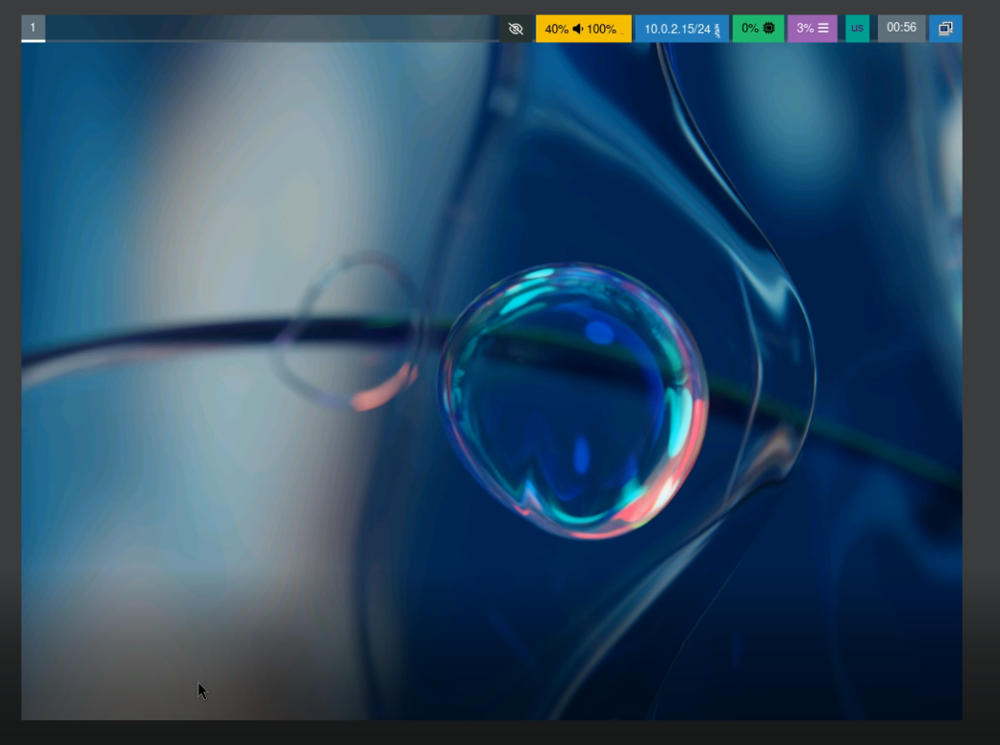

:::
::::::::::::::

## Установка доп софта

- Заходим в терминал и скачиваем все необходимые обновления системы

:::
::: {.column width="30%"}

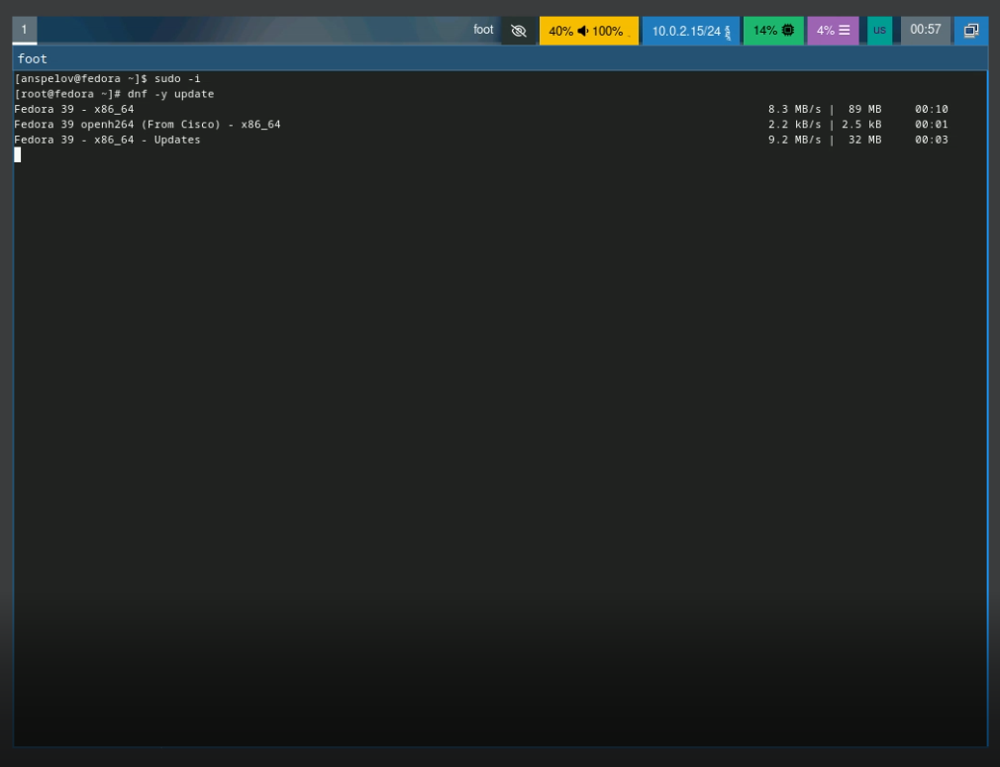

:::
::::::::::::::

## Установка доп софта

- Устанавливаем tmux командой dnf -y install tmux mc, устанавливаем пакет DKMS

:::
::: {.column width="30%"}

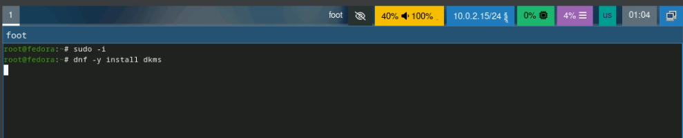

:::
::::::::::::::

## Установка доп софта

- Так же устанавливаем pandoc командой dnf -y install pandoc и TexLive командой dnf -y install texlive-scheme-full

:::
::: {.column width="30%"}

:::
::::::::::::::

# Домашняя работа

## Версия ядра Linux (Linux version).

- Узнаем Версию ядра Linux

:::
::: {.column width="30%"}

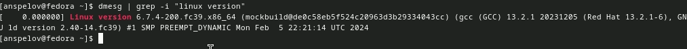

:::
::::::::::::::

## Частота процессора (Detected Mhz processor).

- Узнаем Частоту процессора

:::
::: {.column width="30%"}

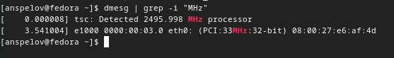

:::
::::::::::::::

## Модель процессора (CPU0).

- Узнаем Модель процессора

:::
::: {.column width="30%"}

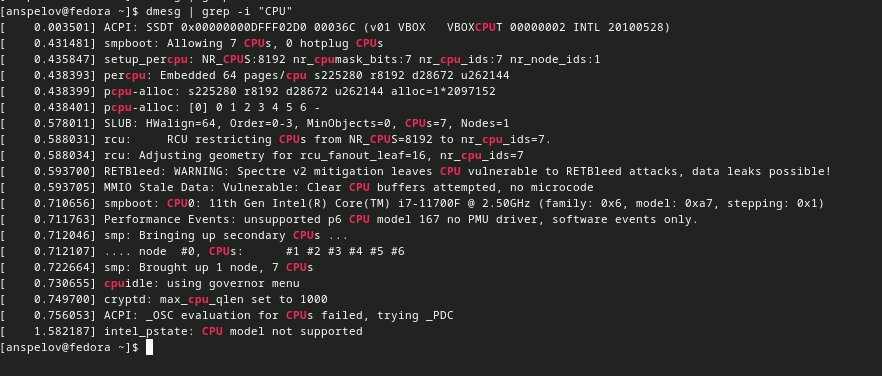

:::
::::::::::::::

## Объём доступной оперативной памяти (Memory available).

- Узнаем Объём доступной оперативной памяти

:::
::: {.column width="30%"}

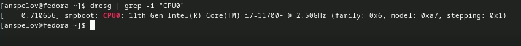

:::
::::::::::::::

## Тип обнаруженного гипервизора (Hypervisor detected).

- Узнаем Тип обнаруженного гипервизора

:::
::: {.column width="30%"}

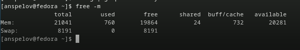

:::
::::::::::::::

## Тип файловой системы корневого раздела.

- Узнаем Тип файловой системы корневого раздела

:::
::: {.column width="30%"}

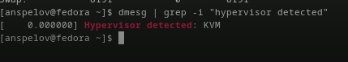

:::
::::::::::::::

## Последовательность монтирования файловых систем.

- Узнаем Последовательность монтирования файловых систем

:::
::: {.column width="30%"}

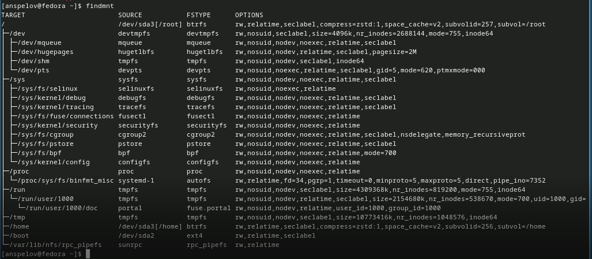

:::
::::::::::::::

# Вывод

- Мы приобрели практические навыки установки операционной системы на виртуальную машину, настройки минимально необходимых для дальнейшей работы сервисов.

:::
