---
## Front matter
title: "Отчёт по лабораторной работе №1"
subtitle: "Установка операционной системы Linux, дистрибутив Fedora Sway на виртуальную машину"
author: "Спелов Андрей Николаевич НПИбд-02-23"

## Generic otions
lang: ru-RU
toc-title: "Содержание"

## Bibliography
bibliography: bib/cite.bib
csl: pandoc/csl/gost-r-7-0-5-2008-numeric.csl

## Pdf output format
toc: true # Table of contents
toc-depth: 2
lof: true # List of figures
lot: true # List of tables
fontsize: 12pt
linestretch: 1.5
papersize: a4
documentclass: scrreprt
## I18n polyglossia
polyglossia-lang:
  name: russian
  options:
	- spelling=modern
	- babelshorthands=true
polyglossia-otherlangs:
  name: english
## I18n babel
babel-lang: russian
babel-otherlangs: english
## Fonts
mainfont: PT Serif
romanfont: PT Serif
sansfont: PT Sans
monofont: PT Mono
mainfontoptions: Ligatures=TeX
romanfontoptions: Ligatures=TeX
sansfontoptions: Ligatures=TeX,Scale=MatchLowercase
monofontoptions: Scale=MatchLowercase,Scale=0.9
## Biblatex
biblatex: true
biblio-style: "gost-numeric"
biblatexoptions:
  - parentracker=true
  - backend=biber
  - hyperref=auto
  - language=auto
  - autolang=other*
  - citestyle=gost-numeric
## Pandoc-crossref LaTeX customization
figureTitle: "Рис."
tableTitle: "Таблица"
listingTitle: "Листинг"
lofTitle: "Список иллюстраций"
lotTitle: "Список таблиц"
lolTitle: "Листинги"
## Misc options
indent: true
header-includes:
  - \usepackage{indentfirst}
  - \usepackage{float} # keep figures where there are in the text
  - \floatplacement{figure}{H} # keep figures where there are in the text
---

# Цель работы

Приобрести практические навыки установки операционной системы на виртуальную машину, настройки минимально необходимых для дальнейшей работы сервисов.

# Выполнение лабораторной работы

На заранее установленный Virtual Box начинаем процесс установки виртуальной машины(называем машину, ставим тип системы) (рис. [-@fig:001]).

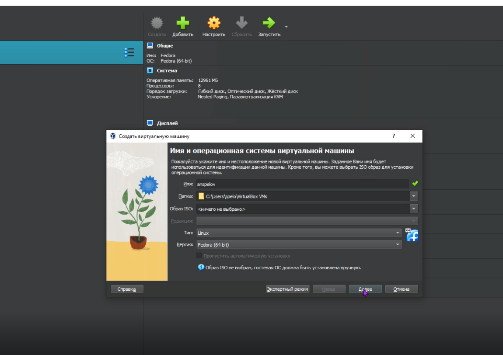{#fig:001 width=70%}

Ставим необходимое для работы количество памяти и ядер процессора (рис. [-@fig:002]).

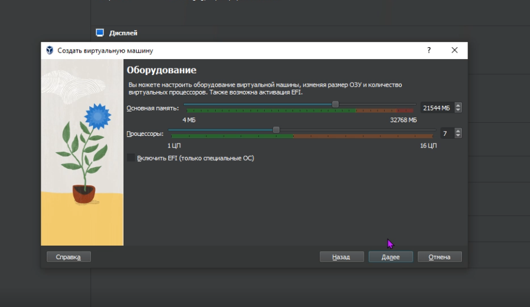{#fig:002 width=70%}

Ставим необходимое количество памяти жесткого диска на виртуальную машину(80+ Гб) (рис. [-@fig:003]).

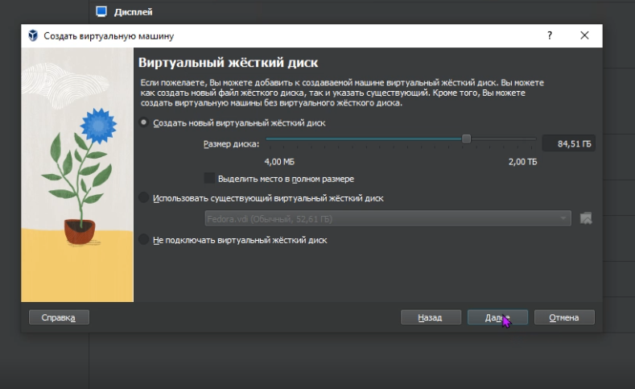{#fig:003 width=70%}

Закончив настройку виртуальной машины в меню Virtual Box выбираем заранее установленную систему Fedora Sway (рис. [-@fig:004]).

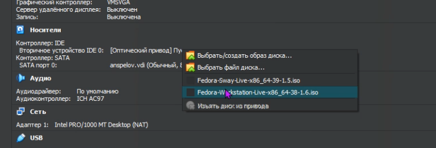{#fig:004 width=70%}

Заходим на виртуальную машину (рис. [-@fig:005]).

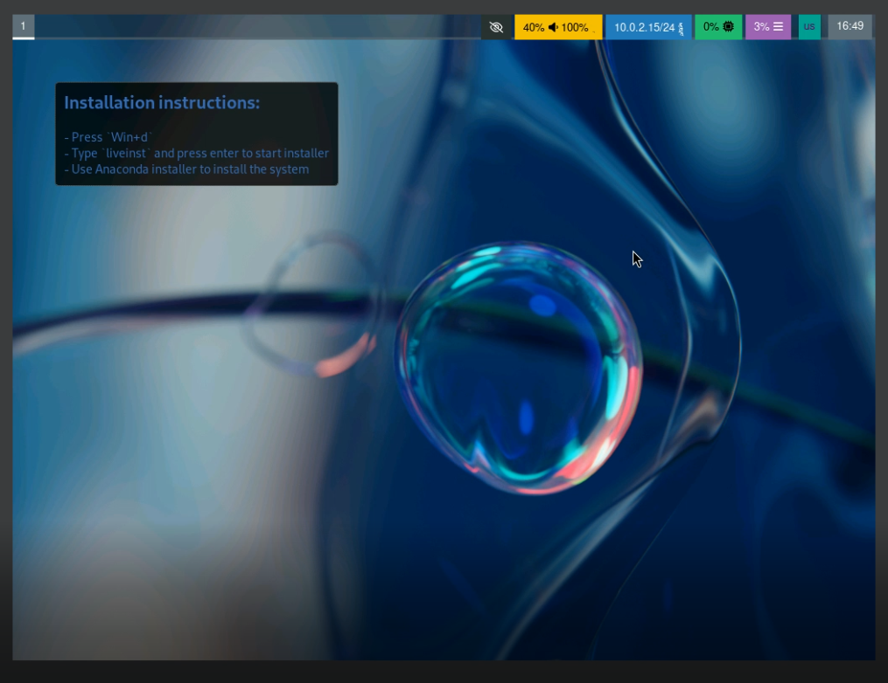{#fig:005 width=70%}

Заходим в меню установки системы (рис. [-@fig:006]).

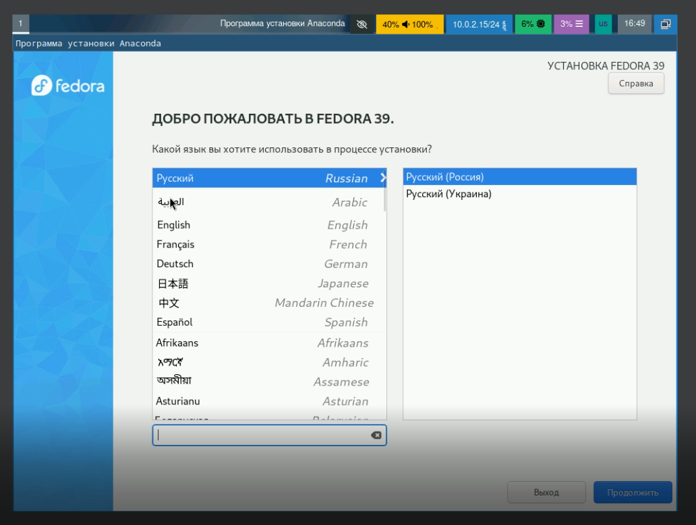{#fig:006 width=70%}

Выбираем все необходимые параметры(раскладку клавиатуры, супер пользователя root) и начинаем установку (рис. [-@fig:007]).

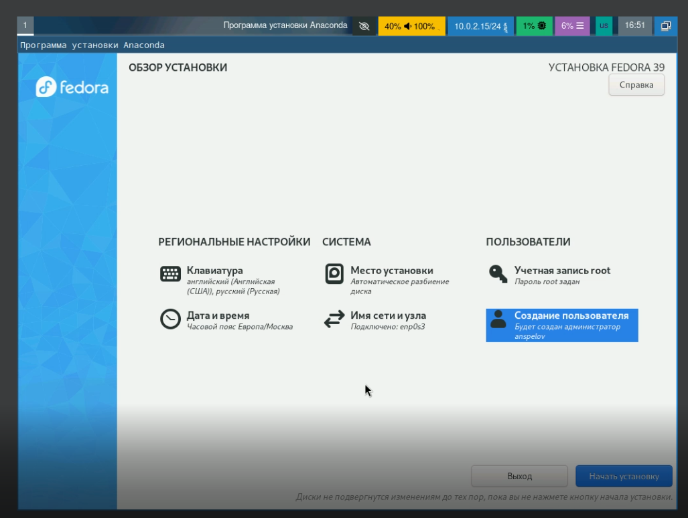{#fig:007 width=70%}

После установки системы закрываем машину и убираем загрузочный диск (рис. [-@fig:008]).

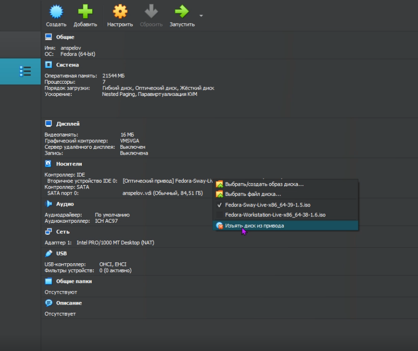{#fig:008 width=70%}

Запускаем виртуальную машину (рис. [-@fig:009]).

{#fig:009 width=70%}

Заходим в терминал и скачиваем все необходимые обновления системы (рис. [-@fig:010]).

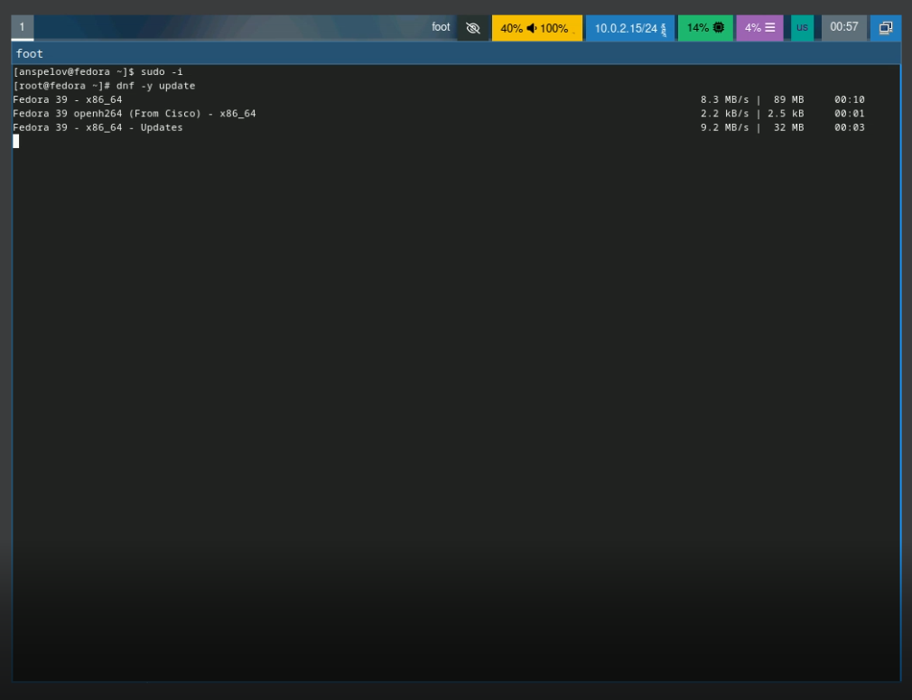{#fig:010 width=70%}

Устанавливаем tmux командой dnf -y install tmux mc, устанавливаем пакет DKMS (рис. [-@fig:011]).

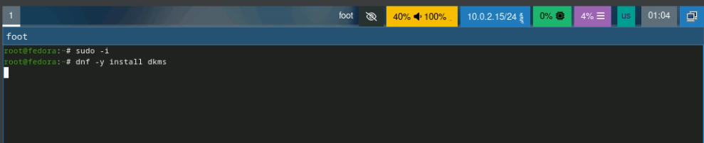{#fig:011 width=70%}

Так же устанавливаем pandoc командой dnf -y install pandoc и TexLive командой dnf -y install texlive-scheme-full (рис. [-@fig:012]).

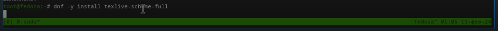{#fig:012 width=70%}

# Домашнее задание

Узнаем Версию ядра Linux  (рис. [-@fig:013]).

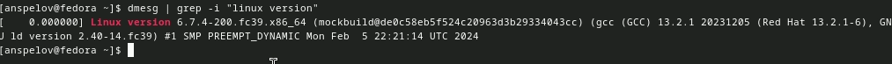{#fig:013 width=70%}

Узнаем Частоту процессора  (рис. [-@fig:014]).

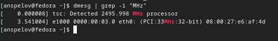{#fig:014 width=70%}

Узнаем Модель процессора  (рис. [-@fig:015]).

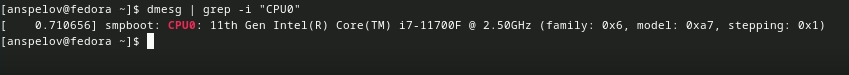{#fig:015 width=70%}

Узнаем Объём доступной оперативной памяти  (рис. [-@fig:016]).

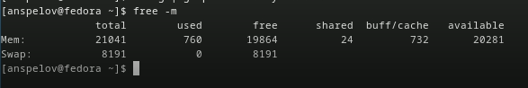{#fig:016 width=70%}

Узнаем Тип обнаруженного гипервизора  (рис. [-@fig:017]).

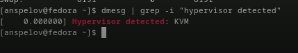{#fig:017 width=70%}

Узнаем Тип файловой системы корневого раздела  (рис. [-@fig:018]).

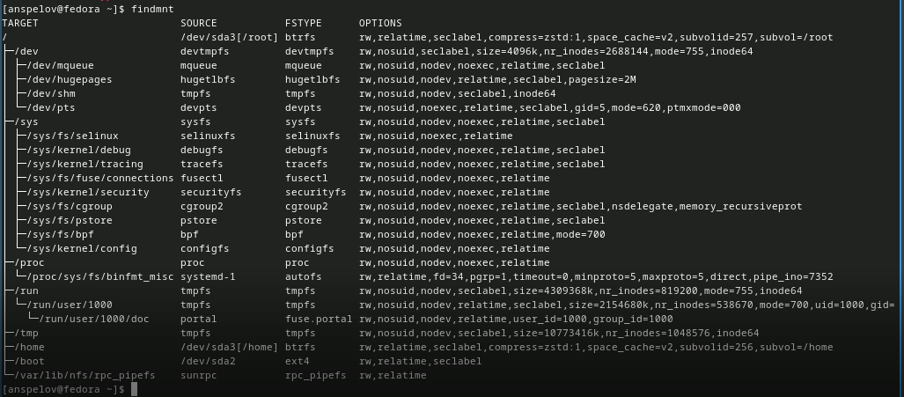{#fig:018 width=70%}

Узнаем Последовательность монтирования файловых систем  (рис. [-@fig:019]).

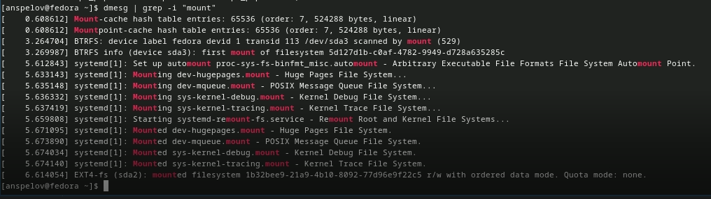{#fig:019 width=70%}

# Выводы

Мы приобрели практические навыки установки операционной системы на виртуальную машину, настройки минимально необходимых для дальнейшей работы сервисов.

# Список литературы{.unnumbered}

::: {#refs}
:::
