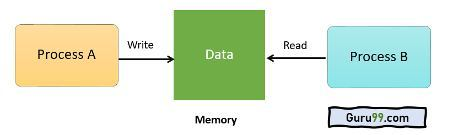

---
## Front matter
lang: ru-RU
title: Доклад на тему
subtitle: История синхронизации процессов
author:
  - Ромицына А.Р.
institute:
  - Российский университет дружбы народов, Москва, Россия
date: 26.02.24

## i18n babel
babel-lang: russian
babel-otherlangs: english

## Formatting pdf
toc: false
toc-title: Содержание
slide_level: 2
aspectratio: 169
section-titles: true
theme: metropolis
header-includes:
 - \metroset{progressbar=frametitle,sectionpage=progressbar,numbering=fraction}
 - '\makeatletter'
 - '\beamer@ignorenonframefalse'
 - '\makeatother'

## Fonts
mainfont: PT Serif
romanfont: PT Serif
sansfont: PT Sans
monofont: PT Mono
mainfontoptions: Ligatures=TeX
romanfontoptions: Ligatures=TeX
sansfontoptions: Ligatures=TeX,Scale=MatchLowercase
monofontoptions: Scale=MatchLowercase,Scale=0.9
---

# Информация

## Докладчик

:::::::::::::: {.columns align=center}
::: {.column width="70%"}

  * Ромицына Анастасия Романовна
  * НПИбд-02-23, студ.билет:1132236132
  * Российский университет дружбы народов
  * [1132236132@pfur.ru]

:::
::: {.column width="30%"}
:::
::::::::::::::

# Основная часть

## Введение

- Синхронизация процессов - это важный аспект в области многозадачности и параллельных вычислений. Она позволяет организовать взаимодействие и координацию между различными процессами, выполняющимися параллельно, и гарантировать правильную и последовательную обработку данных. История синхронизации процессов находится в основе современных операционных систем и является ключевым аспектом при разработке программного обеспечения.

## Ранние системы синхронизации

- С появлением первых компьютерных систем в 50-х годах XX века возникла необходимость в организации параллельной работы процессов. В начале истории синхронизации процессов для координации процессов использовались примитивные механизмы, такие как мьютексы и семафоры. Эти механизмы позволяли блокировать доступ к разделяемым ресурсам и гарантировали последовательное выполнение операций.

{height=66%}

## Модель актерев

- В 70-х годах идею актёрской модели ввёл Карл Хьюитт. Актёр - это объект, который выполняет действия в ответ на получение сообщения. В актёрской модели синхронизация происходит через передачу сообщений между актёрами. Каждый актёр имеет свою собственную очередь сообщений, и он может добавлять сообщения в очередь других актёров. Эта модель позволяет избежать проблем параллельного доступа к разделяемым ресурсам.

{height=66%}

## Мьютексы и семафоры

- С развитием операционных систем в 80-х годах появилось множество новых методов синхронизации процессов. Мьютексы и семафоры были значительно усовершенствованы и стали базовыми примитивами синхронизации во многих операционных системах. Мьютексы позволяют блокировать доступ к разделяемым ресурсам только одному процессу, а семафоры позволяют управлять доступом к определенному количеству ресурсов.

{height=66%}

## Кондвари и мьютексы с условием

- С развитием многопоточности и параллельных вычислений в 90-х годах появились новые механизмы синхронизации процессов. Кондвари - это усовершенствованный вид семафора, который позволяет организовать ожидание нескольких условий. Мьютексы с условием позволяют блокировать выполнение процесса до наступления определенного условия.

## Заключение

- История синхронизации процессов является ключевой для понимания развития параллельных вычислений и многозадачности. Начиная с простых механизмов, таких как мьютексы и семафоры, и заканчивая современными технологиями транзакционной синхронизации, синхронизация процессов продолжает играть важную роль в разработке программного обеспечения и управлении вычислительными системами. Понимание истории синхронизации процессов позволяет нам лучше понять современные технологии и разработать эффективные алгоритмы синхронизации.

