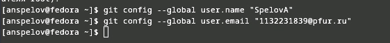
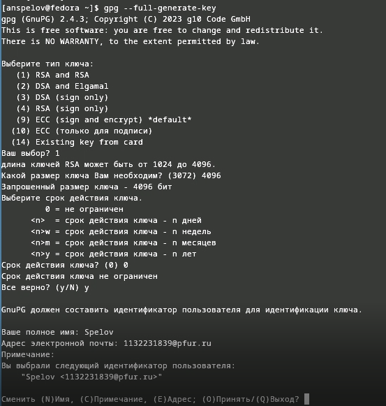
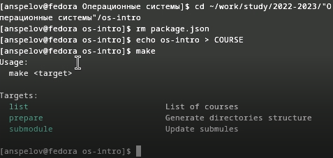

---
## Front matter
lang: ru-RU
title: Отчет по лабораторной работе №2
subtitle: Работа с Git
author:
  - Спелов А. Н.
institute:
  - Российский университет дружбы народов, Москва, Россия
date: 23 февраля 2024

## i18n babel
babel-lang: russian
babel-otherlangs: english

## Formatting pdf
toc: false
toc-title: Содержание
slide_level: 2
aspectratio: 169
section-titles: true
theme: metropolis
header-includes:
 - \metroset{progressbar=frametitle,sectionpage=progressbar,numbering=fraction}
 - '\makeatletter'
 - '\beamer@ignorenonframefalse'
 - '\makeatother'
 
## Fonts
mainfont: PT Serif
romanfont: PT Serif
sansfont: PT Sans
monofont: PT Mono
mainfontoptions: Ligatures=TeX
romanfontoptions: Ligatures=TeX
sansfontoptions: Ligatures=TeX,Scale=MatchLowercase
monofontoptions: Scale=MatchLowercase,Scale=0.9
---

# Информация

## Докладчик

:::::::::::::: {.columns align=center}
::: {.column width="70%"}

  * Спелов Андрей Николаевич
  * НПИбд-02-23 Студ. билет:
  * Российский университет дружбы народов
  * [1132231839@pfur.ru](mailto:1132231839@pfur.ru)

:::
::: {.column width="30%"}
:::
::::::::::::::

# Вводная часть

## Цели и задачи

- Изучить идеологию и применение средств контроля версий и освоить умения по работе с git.

# Выполнение лабораторной работы

## Настройка GIT

- После установки git и gh переходим к настройке. Зададим имя и email владельца.

:::
::: {.column width="30%"}

:::
::::::::::::::

## Настройка GIT

- Настроим utf-8 в выводе сообщений git
:::
::: {.column width="30%"}

:::
::::::::::::::

## Настройка GIT

- Зададим имя начальной ветки (будем называть её master)

:::
::: {.column width="30%"}

:::
::::::::::::::

## Настройка GIT

- Задаем параметр autocrlf

:::
::: {.column width="30%"}

:::
::::::::::::::

## Настройка GIT

- Задаем параметр safecrlf

:::
::: {.column width="30%"}

:::
::::::::::::::

## Создание SSH ключей

- Создаем SSH ключ по алгоритму rsa

:::
::: {.column width="30%"}

:::
::::::::::::::

## Создание SSH ключей

- Создаем SSH ключ по алгоритму ed25519

:::
::: {.column width="30%"}

:::
::::::::::::::

## Создание GPG ключа

- Создаем GPG ключ с нужными параметрами

:::
::: {.column width="30%"}

:::
::::::::::::::

## Создание GPG ключа

- Выводим список ключей командой gpg --list-secret-keys --keyid-format LONG

:::
::: {.column width="30%"}

:::
::::::::::::::

## Создание GPG ключа

- Cкопируем наш сгенерированный PGP ключ в буфер обмена

:::
::: {.column width="30%"}

:::
::::::::::::::

## Создание GPG ключа

- Заходим в настройки GitHub и вставляем GPG ключ

:::
::: {.column width="30%"}

:::
::::::::::::::

## Настройка нашего GIT

- Настраиваем автоматические подписи коммитов git

:::
::: {.column width="30%"}

:::
::::::::::::::

## Настройка GH

- Начинаем настройку GH

:::
::: {.column width="30%"}

:::
::::::::::::::

## Cоздание рабочего пространства

- Создаем рабочие папки в системе, переходим в нее и создаем шаблон рабочего пространства

:::
::: {.column width="30%"}

:::
::::::::::::::

## Cоздание рабочего пространства

- Создаем репозиторий шаблона

:::
::: {.column width="30%"}

:::
::::::::::::::

## Cоздание рабочего пространства

- В каталоге курса удаляем лишние файлы и создаем необходимые каталоги

:::
::: {.column width="30%"}

:::
::::::::::::::

## Отправка файлов

- Отправляем файлы на сервер

:::
::: {.column width="30%"}

:::
::::::::::::::

# Вывод

- Мы изучили идеологию и применение средств контроля версий и освоили умения по работе с git.

:::
