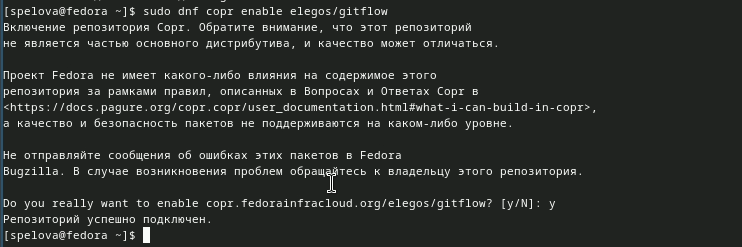

---
## Front matter
lang: ru-RU
title: Отчет по лабораторной работе №4
subtitle: Работа с репозиториями Git
author:
  - Спелов А. Н.
institute:
  - Российский университет дружбы народов, Москва, Россия
date: 23 февраля 2024

## i18n babel
babel-lang: russian
babel-otherlangs: english

## Formatting pdf
toc: false
toc-title: Содержание
slide_level: 2
aspectratio: 169
section-titles: true
theme: metropolis
header-includes:
 - \metroset{progressbar=frametitle,sectionpage=progressbar,numbering=fraction}
 - '\makeatletter'
 - '\beamer@ignorenonframefalse'
 - '\makeatother'
 
## Fonts
mainfont: PT Serif
romanfont: PT Serif
sansfont: PT Sans
monofont: PT Mono
mainfontoptions: Ligatures=TeX
romanfontoptions: Ligatures=TeX
sansfontoptions: Ligatures=TeX,Scale=MatchLowercase
monofontoptions: Scale=MatchLowercase,Scale=0.9
---

# Информация

## Докладчик

:::::::::::::: {.columns align=center}
::: {.column width="70%"}

  * Спелов Андрей Николаевич
  * НПИбд-02-23 Студ. билет:
  * Российский университет дружбы народов
  * [1132231839@pfur.ru](mailto:1132231839@pfur.ru)

:::
::: {.column width="30%"}
:::
::::::::::::::

# Вводная часть

## Цели и задачи

- Получить навыки правильной работы с репозиториями git.

# Выполнение лабораторной работы

## Скачиваем нужный софт

- Подключаем corp репозиторий

## Скачиваем нужный софт

- Скачиваем пакет gitflow

## Скачиваем нужный софт

- Скачиваем пакет nodejs

## Скачиваем нужный софт

- Скачиваем пакет pnpm

## Скачиваем нужный софт

- Запускаем pnpm

## Скачиваем нужный софт

- Перелогиниваемся и делаем общепринятый коммит

## Скачиваем нужный софт

- Вводим комманду для помощи создании логов

## Создание репозитория

- Создаем новый репозиторий git-extended

## Работа с репозиторием

- Клонируем репозиторий в папку work

## Работа с репозиторием

- Делаем первый коммит и выкладываем на github

## Работа с репозиторием

- Конфигурация для пакетов Node.js

## Работа с репозиторием

- Меняем package.json в mc

## Работа с репозиторием

- Добавляем новые файлы и отправляем на github

## Работа с репозиторием

- Инициализируем git-flow

## Работа с репозиторием

- Проверяем, что мы на ветке develop

## Работа с репозиторием

- Проверяем, что мы на ветке develop

## Работа с репозиторием

- Установите внешнюю ветку как вышестоящую для этой ветки

## Работа с репозиторием

- Создадим релиз с версией 1.0.0

## Работа с репозиторием

- Создадим журнал изменений

## Работа с репозиторием

- Добавим журнал изменений в индекс

## Работа с репозиторием

- Зальём релизную ветку в основную ветку

## Работа с репозиторием

- Отправим данные на github

## Работа с репозиторием

- Создадим релиз на github

## Работа с репозиторием

- Создадим ветку для новой функциональности

## Работа с репозиторием

- Объединяем ветки

## Работа с репозиторием

- Создадим релиз с версией 1.2.3

## Работа с репозиторием

- Меняем package.json в mc

## Работа с репозиторием

- Cоздадим журнал изменений

## Работа с репозиторием

- Добавим журнал изменений в индекс

## Работа с репозиторием

- Зальём релизную ветку в основную ветку

## Работа с репозиторием

- Отправим данные на github

## Работа с репозиторием

- Создадим релиз на github с комментарием из журнала изменений

# Вывод

- Мы изучили идеологию и применение средств контроля версий и освоили умения по работе с git.

