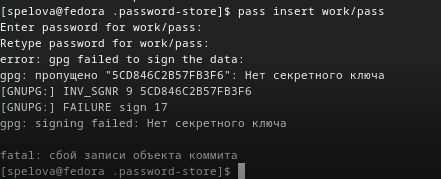

---
## Front matter
lang: ru-RU
title: Отчет по лабораторной работе №5
subtitle: Правильная настройка рабочей среды
author:
  - Спелов А. Н.
institute:
  - Российский университет дружбы народов, Москва, Россия
date: 23 февраля 2024

## i18n babel
babel-lang: russian
babel-otherlangs: english

## Formatting pdf
toc: false
toc-title: Содержание
slide_level: 2
aspectratio: 169
section-titles: true
theme: metropolis
header-includes:
 - \metroset{progressbar=frametitle,sectionpage=progressbar,numbering=fraction}
 - '\makeatletter'
 - '\beamer@ignorenonframefalse'
 - '\makeatother'
 
## Fonts
mainfont: PT Serif
romanfont: PT Serif
sansfont: PT Sans
monofont: PT Mono
mainfontoptions: Ligatures=TeX
romanfontoptions: Ligatures=TeX
sansfontoptions: Ligatures=TeX,Scale=MatchLowercase
monofontoptions: Scale=MatchLowercase,Scale=0.9
---

# Информация

## Докладчик

:::::::::::::: {.columns align=center}
::: {.column width="70%"}

  * Спелов Андрей Николаевич
  * НПИбд-02-23 Студ. билет:
  * Российский университет дружбы народов
  * [1132231839@pfur.ru](mailto:1132231839@pfur.ru)

:::
::: {.column width="30%"}
:::
::::::::::::::

# Вводная часть

## Цели и задачи

- Получить навыки правильной настройки рабочей среды.

# Выполнение лабораторной работы

## Установка ПО

- Устанавливаем pass

## Установка ПО

- Устанавливаем gopass

## Настройка

- Инициализируем хранилище

## Настройка

- Задаем адрес репозитория и создаем структуру

## Настройка

- Синхронизируем

## Настройка

- Вручную закоммитим и выложим изменения

## Настройка

- Проверим статус синхронизации

## Настройка интерфейса с броузером

- Настройка интерфейса с браузером

## Настройка интерфейса с броузером

- Настройка интерфейса с браузером

## Сохранение пароля

- Добавим новый пароль

## Сохранение пароля

- Проверим пароль и зададим новый

## Управление файлами конфигурации

- Установим дополнительное программное обеспечение

## Управление файлами конфигурации

- Установим шрифты

## Управление файлами конфигурации

- Установим бинарный файл

# Вывод

- Мы получили навыки правильной настройки рабочей среды.

