---
## Front matter
lang: ru-RU
title: Отчет по лабораторной работе №6
subtitle: Основы интерфейса взаимодействия пользователя с системой Unix на уровне командной строки
author:
  - Спелов А. Н.
institute:
  - Российский университет дружбы народов, Москва, Россия
date: 23 февраля 2024

## i18n babel
babel-lang: russian
babel-otherlangs: english

## Formatting pdf
toc: false
toc-title: Содержание
slide_level: 2
aspectratio: 169
section-titles: true
theme: metropolis
header-includes:
 - \metroset{progressbar=frametitle,sectionpage=progressbar,numbering=fraction}
 - '\makeatletter'
 - '\beamer@ignorenonframefalse'
 - '\makeatother'
 
## Fonts
mainfont: PT Serif
romanfont: PT Serif
sansfont: PT Sans
monofont: PT Mono
mainfontoptions: Ligatures=TeX
romanfontoptions: Ligatures=TeX
sansfontoptions: Ligatures=TeX,Scale=MatchLowercase
monofontoptions: Scale=MatchLowercase,Scale=0.9
---

# Информация

## Докладчик

:::::::::::::: {.columns align=center}
::: {.column width="70%"}

  * Спелов Андрей Николаевич
  * НПИбд-02-23 Студ. билет:
  * Российский университет дружбы народов
  * [1132231839@pfur.ru](mailto:1132231839@pfur.ru)

:::
::: {.column width="30%"}
:::
::::::::::::::

# Вводная часть

## Цели и задачи

- Приобретение практических навыков взаимодействия пользователя с системой посредством командной строки.

# Выполнение лабораторной работы

## Имя каталога

- Определим полное имя вашего домашнего каталога

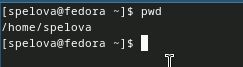

## Команда ls

- Перейдем в папку tmp и используем команду ls

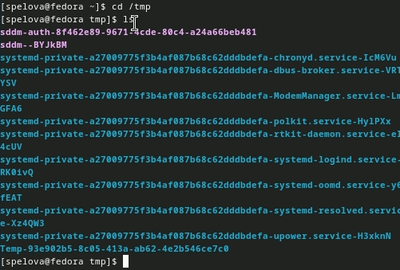

## Команда ls

- Используем команду ls -a, чтобы отобразить имена скрытых файлов

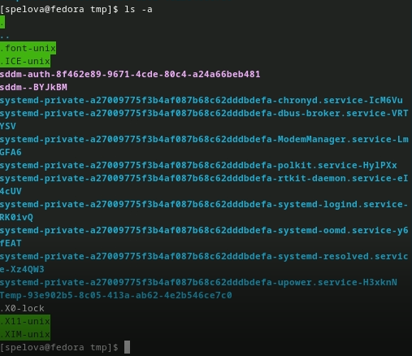

## Команда ls

- Используем команду ls -l, чтобы вывести подробную информацию о файлах и каталогах

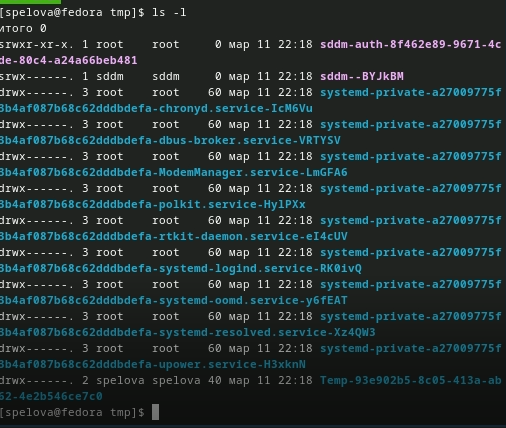

## Команда ls

- Используем команду ls -F, чтобы получить информацию о типах файлов

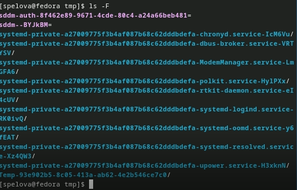

## Команда ls

- Используем команду ls -alF, включены все опции

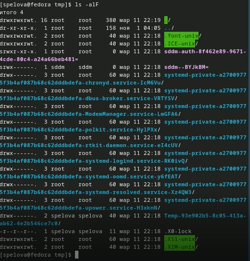

## Проверка папки

- Переходим в папку spool и командой ls проверяем есть ли папка cron

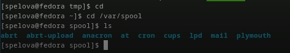

## Команда ls

- Переходим в домашний каталог и выводим информацию о владельце папок

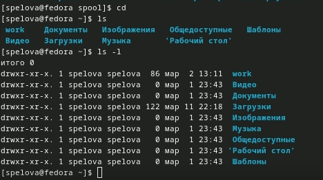

## Создание папок

- Создаем папку newdir переходим в нее и создаем папку morefun

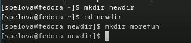

## Создание папок

- Переходим в домашний каталог и создаем 3 папки

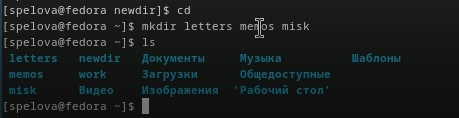

## Удаление папок

- Удаляем одной командой 3 папки

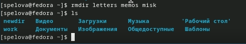

## Удаление папок

- Пытаемся удалить папку newdir командой rm(так нельзя)

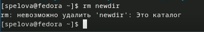

## Удаление папок

- Удаляем папку morefun из папки newdir

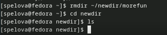

## Команда man

- С помощью команды man ls выяснили, что чтобы просмотреть содержимое не только каталогов но и подкатологов нужно использовать опцию -R

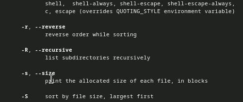

## Команда man

- С помощью команды man ls выяснили, что чтобы отсортировать по времени последнего изменения выводимый список содержимого каталога с развёрнутым описанием файлов нужно использовать опцию -c -lt

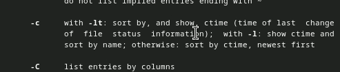

## Команда man

- Команда cd используется для перемещения по файлам

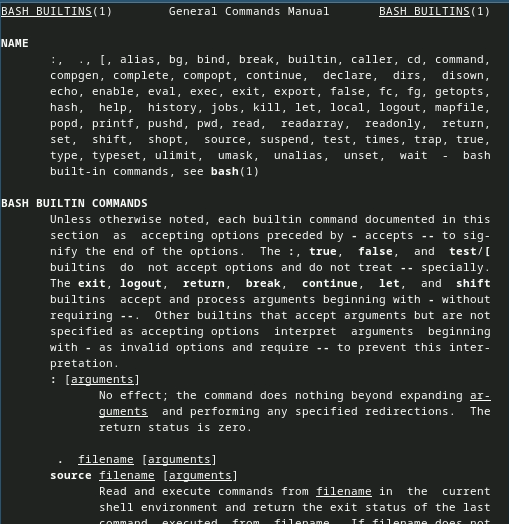

## Команда man

- Команда pwd используется для определения абсолютного пути к текущему каталогу

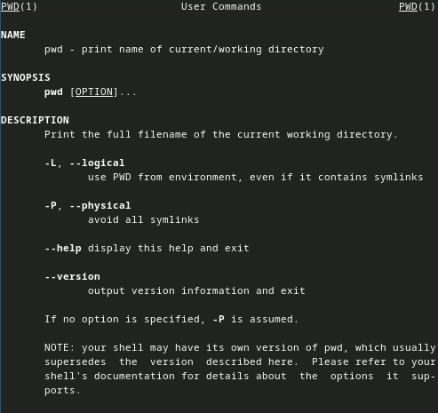

## Команда man

- Команда mkdir используется для создания каталогов

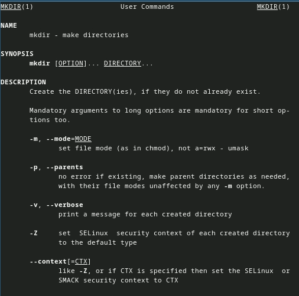

## Команда man

- Команда rmdir используется для удаления каталогов

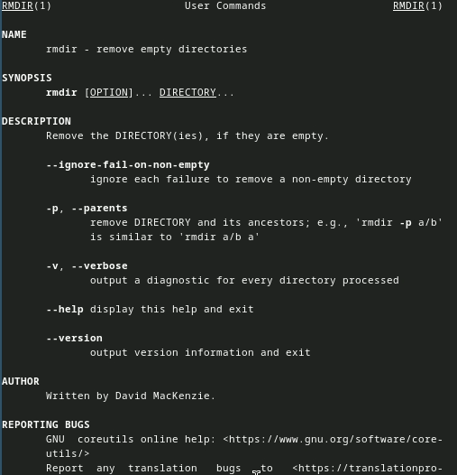

## Команда man

- Команда rm используется для удаления файлов

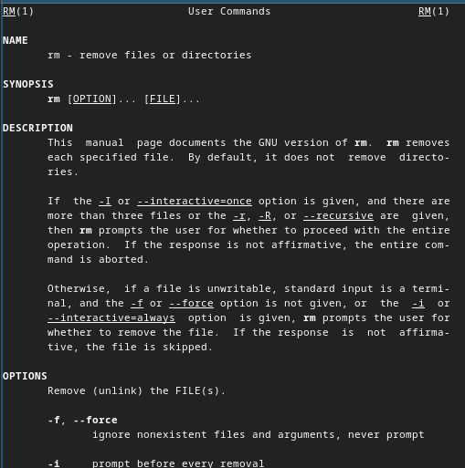

## Команда man

- Используем информацию, полученную при помощи команды history, выполняем модификацию команд cd и ls, после чего исполняем их

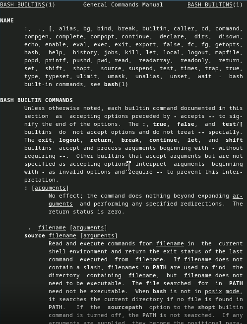

# Вывод

- Мы приобрели практические навыки взаимодействия пользователя с системой посредством командной строки.

