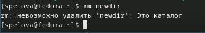

---
## Front matter
title: "Отчёт по лабораторной работе №6"
subtitle: "Основы интерфейса взаимодействия пользователя с системой Unix на уровне командной строки"
author: "Спелов Андрей Николаевич НПИбд-02-23"

## Generic otions
lang: ru-RU
toc-title: "Содержание"

## Bibliography
bibliography: bib/cite.bib
csl: pandoc/csl/gost-r-7-0-5-2008-numeric.csl

## Pdf output format
toc: true # Table of contents
toc-depth: 2
lof: true # List of figures
lot: true # List of tables
fontsize: 12pt
linestretch: 1.5
papersize: a4
documentclass: scrreprt
## I18n polyglossia
polyglossia-lang:
  name: russian
  options:
	- spelling=modern
	- babelshorthands=true
polyglossia-otherlangs:
  name: english
## I18n babel
babel-lang: russian
babel-otherlangs: english
## Fonts
mainfont: PT Serif
romanfont: PT Serif
sansfont: PT Sans
monofont: PT Mono
mainfontoptions: Ligatures=TeX
romanfontoptions: Ligatures=TeX
sansfontoptions: Ligatures=TeX,Scale=MatchLowercase
monofontoptions: Scale=MatchLowercase,Scale=0.9
## Biblatex
biblatex: true
biblio-style: "gost-numeric"
biblatexoptions:
  - parentracker=true
  - backend=biber
  - hyperref=auto
  - language=auto
  - autolang=other*
  - citestyle=gost-numeric
## Pandoc-crossref LaTeX customization
figureTitle: "Рис."
tableTitle: "Таблица"
listingTitle: "Листинг"
lofTitle: "Список иллюстраций"
lotTitle: "Список таблиц"
lolTitle: "Листинги"
## Misc options
indent: true
header-includes:
  - \usepackage{indentfirst}
  - \usepackage{float} # keep figures where there are in the text
  - \floatplacement{figure}{H} # keep figures where there are in the text
---

# Цель работы

Приобретение практических навыков взаимодействия пользователя с системой посредством командной строки.

# Выполнение лабораторной работы

Определим полное имя вашего домашнего каталога (рис. [-@fig:001]).

{#fig:001 width=70%}

Перейдем в папку tmp и используем команду ls (рис. [-@fig:002]).

{#fig:002 width=70%}

Используем команду ls -a, чтобы отобразить имена скрытых файлов (рис. [-@fig:003]).

{#fig:003 width=70%}

Используем команду ls -l, чтобы вывести подробную информацию о файлах и каталогах (рис. [-@fig:004]).

{#fig:004 width=70%}

Используем команду ls -F, чтобы получить информацию о типах файлов (рис. [-@fig:005]).

{#fig:005 width=70%}

Используем команду ls -alF, включены все опции (рис. [-@fig:006]).

{#fig:006 width=70%}

Переходим в папку spool и командой ls проверяем есть ли папка cron (рис. [-@fig:007]).

{#fig:007 width=70%}

Переходим в домашний каталог и выводим информацию о владельце папок (рис. [-@fig:008]).

{#fig:008 width=70%}

Создаем папку newdir переходим в нее и создаем папку morefun (рис. [-@fig:009]).

{#fig:009 width=70%}

Переходим в домашний каталог и создаем 3 папки (рис. [-@fig:010]).

{#fig:010 width=70%}

Удаляем одной командой 3 папки (рис. [-@fig:011]).

{#fig:011 width=70%}

Пытаемся удалить папку newdir командой rm( так нельзя) (рис. [-@fig:012]).

{#fig:012 width=70%}

Удаляем папку morefun из папки newdir (рис. [-@fig:013]).

{#fig:013 width=70%}

С помощью команды man ls выяснили, что чтобы просмотреть содержимое не только каталогов но и подкатологов нужно использовать опцию -R (рис. [-@fig:014]).

{#fig:014 width=70%}

С помощью команды man ls выяснили, что чтобы отсортировать по времени последнего изменения выводимый список содержимого каталога с развёрнутым описанием файлов нужно использовать опцию -c -lt (рис. [-@fig:015]).

{#fig:015 width=70%}

Команда cd используется для перемещения по файлам (рис. [-@fig:016]).

{#fig:016 width=70%}

Команда pwd используется для определения абсолютного пути к текущему каталогу (рис. [-@fig:017]).

{#fig:017 width=70%}

Команда mkdir используется для создания каталогов (рис. [-@fig:018]).

{#fig:018 width=70%}

Команда rmdir используется для удаления каталогов (рис. [-@fig:019]).

{#fig:019 width=70%}

Команда rm используется для удаления файлов (рис. [-@fig:020]).

{#fig:020 width=70%}

Используем информацию, полученную при помощи команды history, выполняем модификацию команд cd и ls, после чего исполняем их (рис. [-@fig:021]).

{#fig:021 width=70%}

# Выводы

Мы приобрели практические навыки взаимодействия пользователя с системой посредством командной строки.

# Список литературы{.unnumbered}

::: {#refs}
:::
